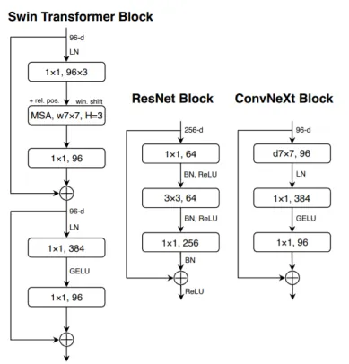
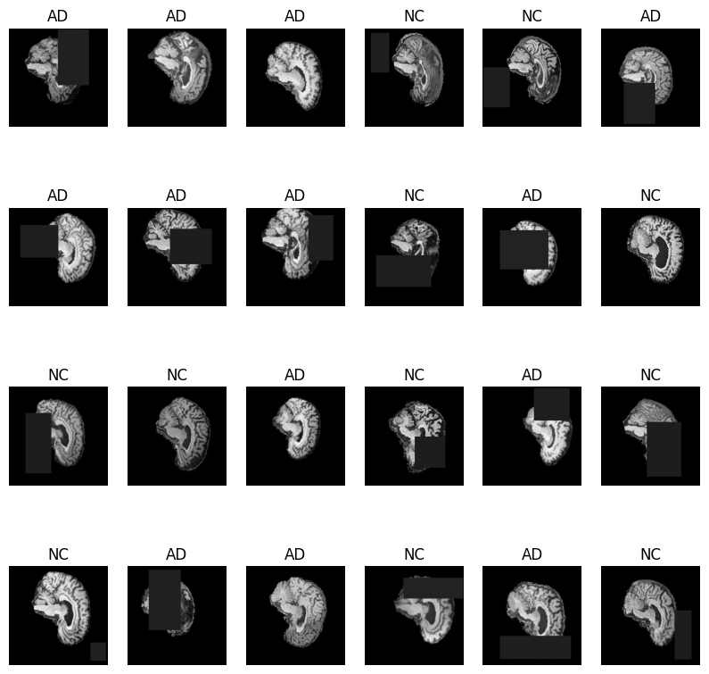
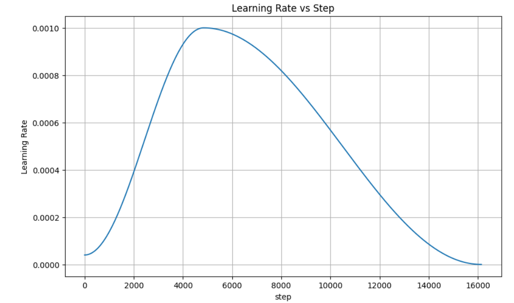
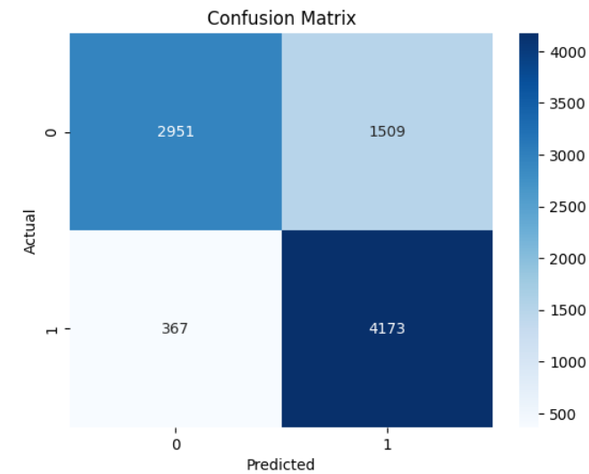
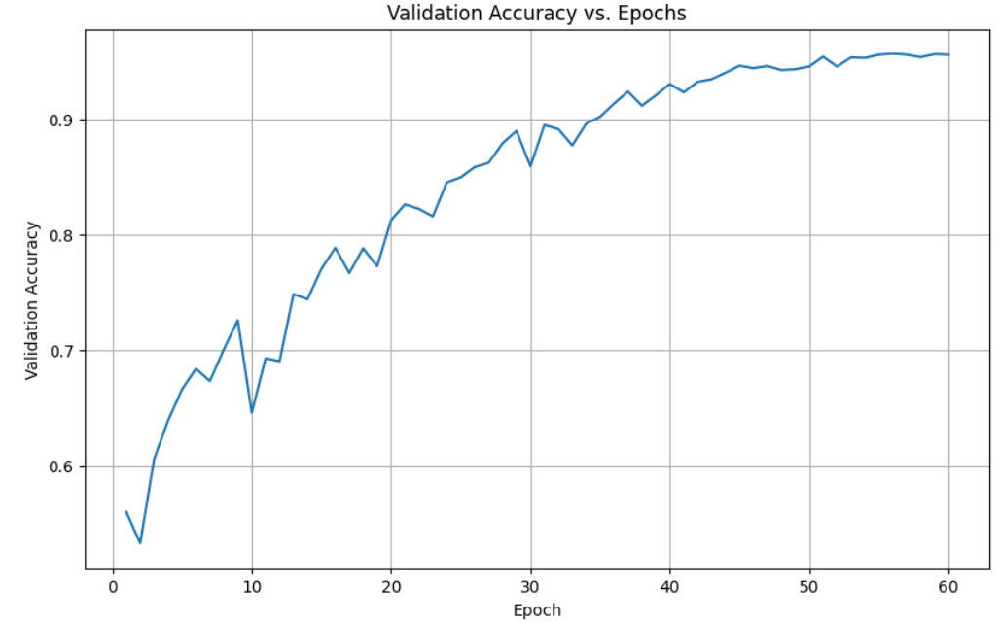
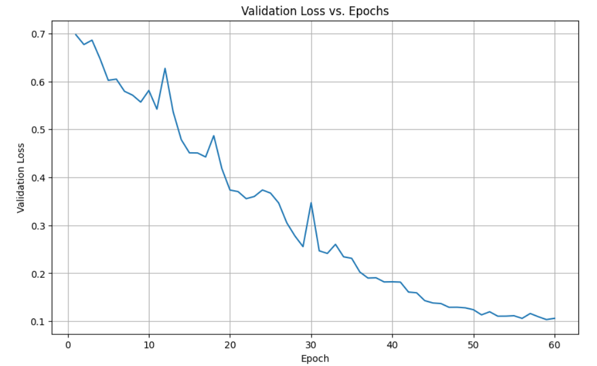
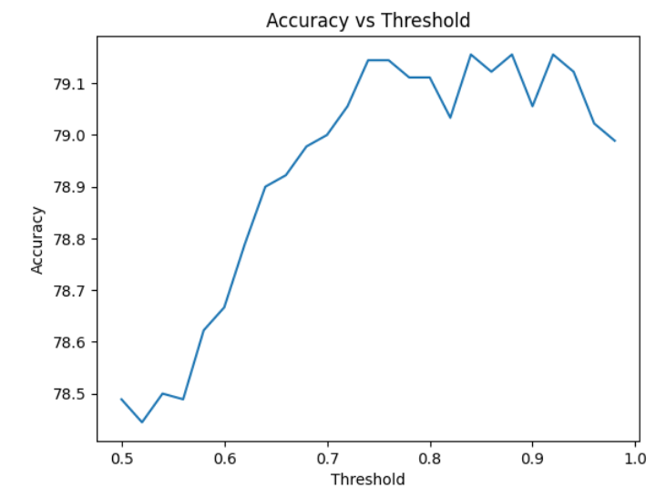

# ConvNeXt Image Classificaiton on ADNI Data 
Developed by Kayla Malherbe
Student numbers: s4747715

## Introduction
The elected task was to Classify Alzheimer’s disease (normal (NC) and AD) of the ADNI brain data using ConvNext. 

The aim of the model is to detect Alzheimers in MIR scans with an accuracy of 80%. Given the medical context of the problem identifying false positives and false negatives will be important to analysising the model's success in real world applicaitons.


## Model Description
In the 2020s, CovNeXt was developed as a classification model inspired by Vision Transformers (ViTs) and standard ConvNets like ResNet. CovNeXt uses elements from both of these models to create a modernised convolutional neural network architecture. The figure below shows the core architecture of the three models in comparison.



Swin and ConvNeXt both use Gelu as the activation function instead of ReLu used by ResNet. Additionally, Resnet uses batch normalisation, where as the other two utilise layer normalisation, which improves stability. 

![GeeksForGeeks [3]](images/image.png)
It uses 4 iterations of convNeXt blocks with varying depths and widths

Using activation function GELU instead of ReLU


### Data loading and preprocessing
The ADNI dataset used for training consists of two classes (NC and AD) with a test and train dataset presplit. 

The dataloader used a variety of transforms to augment the training dataset in order to create a much more generalised model to perform on unseen data. 

The transformed performed were:
```
transform = transforms.Compose([
        transforms.RandomResizedCrop((IMAGE_DIM, IMAGE_DIM), scale=(0.95, 1.0), antialias=True),
        transforms.Grayscale(num_output_channels=1),
        transforms.RandomRotation(degrees=10),
        transforms.RandomAdjustSharpness(sharpness_factor=2, p=0.3),
        transforms.RandomAutocontrast(p=0.2),
        transforms.RandomPosterize(bits=4, p=0.1),
        transforms.RandomAffine(degrees=5, translate=(0.05, 0.05), scale=(0.9, 1.1)), # Slightly increased translate and scale
        transforms.ToTensor(),
        transforms.Normalize(mean=mean, std=std),
        transforms.RandomErasing(p=0.8, scale=(0.02, 0.2), ratio=(0.3, 3.3)),
    ])
```


The mean and std were calculated across the entire train dataset, and an average was used for preprocessing.

The criterion used was BCEWithLogicLoss because ...
The chosen optimiser used as AdamW because ...

Learning rate scheduling was also added to help the training. The scheduler used was the one-cycle LR scheduler as seen in the figure below:

Scheduler Learning rate



### Train and Validation split
The train dataset provided was relatively balanced between the AD and NC classes. The AD class made up 48.327% of the dataset and the NC class made up the other 51.673%. The validation set came out from the train dataset and the split was
80/20. The test set provided was therefore left completely untouched until the model was fully trained and testing was performed.

Class distribution in dl_aug (Training DataLoader):
Class AD (0): 8311
Class NC (1): 8905

Class distribution in val_dl_aug (Validation DataLoader):
Class NC (1): 2215
Class AD (0): 2089

### Data Regularisation 
Various data regularisations was added with the aim of improving the generalization of the model. This included dropouts and stochastic_depth within the ConVneXt block. 

## Final Results
The best test accuracy was 79.155%. 
Confusion Matrix


Where 0 is the NC class and 1 is the AD class. 

From the confusion matrix it is clear there is a bais towards false positives than there is to false negatives. This is desirable in most medical field imaging problems as it is more severe to have a false negative result as then
patients will not be treated whereas a false positive result can be further checked and confirmed.


Validation Accuracy vs epochs


validation loss vs epochs 


The validation during training indicates that the model is overfitting towards The training and validation data, as there is such a large gap between validation accuracy and test accuracy. Even with extensive data regulation, additional data
augmentation and parameter checking, the overfitting nature remains and therefore could be caused by some data leakage or inconsistency between the train and  test dataset.

To maximise the output of a given model, a threshold was performed to examine the optimal value.

Thresholding


For this case, the optimal thresholding value was 0.86. This indicates there is some lean or bias towards the class 1 (AD), which was confirmed in the confusion matrix.

## Evaluation
The model's best performance wsa 79.155% test accuracy which falls just shy of the 80% target margin, this performance is highly promising and demonstrates the model is likely to be able to meet these requirements, given the right parameters. 

Some extensions that could be recommended is using a different learning rate scheduler such as the decaying cosine scheduler used in the published CovNeXt report. 

Additionally, the preprocessing and training validation split did not consider that each patient had 20 scans, and therefore, that may have caused some data leakage leading to very high performance in testing leading the gap between validation accuracy and test accuracy. 


## Usage
### Training
Training can be run in the train.py file by the main function or by calling from
a terminal:
``` 
python train.py 
```
The paths data_location and test_location need to be edited in train.py before
running.

### Testing
Testing can be run after developing the model using the functions in predict.py
```
    performance = predict(model, test_dl_aug)
    opt_thres, performance = thresholding(model, device, test_dl_aug)
```
This is included when running train.py but can also be done separately.

### Necessary Libraries required
```
import torchvision.transforms as transforms
import matplotlib.pyplot as plt
import numpy as np
import torch
from torch import nn, Tensor
from torch.utils.data import DataLoader, random_split
import torchvision.transforms as transforms
import torchvision.datasets as datasets
from torchvision.ops import StochasticDepth
import torchvision.transforms as transforms
import os
import pickle
from collections import Counter
import seaborn as sns
from sklearn.metrics import confusion_matrix
from typing import List
```

#### Versions used
- torch >= 2.8.0+cu126
- torchvision >= 0.23.0+cu126
- matplotlib >= 3.10.0
- numpy >= 2.0.2
- seaborn >= 0.13.2
- sklearn >= 1.6.1


## References
[1] Z. Liu, H. Mao, C.-Y. Wu, C. Feichtenhofer, T. Darrell, and S. Xie, “A ConvNet for the 2020s,”
arXiv:2201.03545 [cs], Mar. 2022, arXiv: 2201.03545. [Online]. Available: http://arxiv.org/abs/2201.03545

[2] Augmented Starups, "ConvNeXt: The Return of COnvolution Netowrks." Medium. Available: https://medium.com/augmented-startups/convnext-the-return-of-convolution-networks-e70cbe8dabcc

[3] GeeksforGeeks, "ConvNeXt." GeeksforGeeks. Available: https://www.geeksforgeeks.org/computer-vision/convnext/

