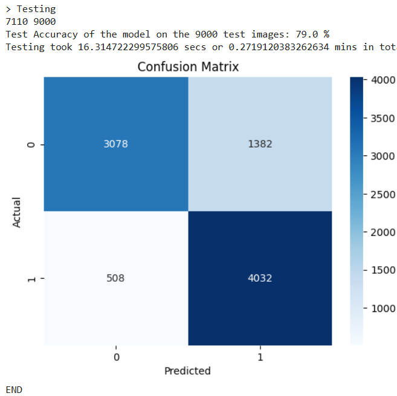
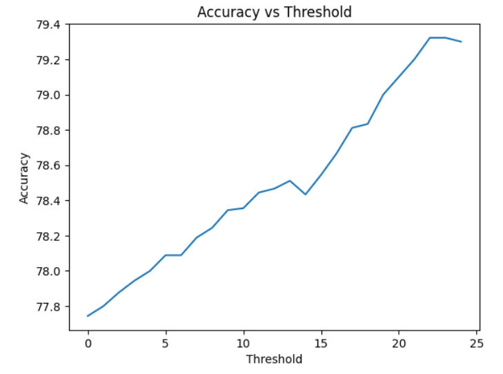

# Title 

Data loading

- additional augmentation added to preprocessing

Results of last run
Confusion Matrix

Scheduler Learning rate

Validation Accuracy vs epochs

validation loss vs epochs 

Thresholding

References
https://medium.com/augmented-startups/convnext-the-return-of-convolution-networks-e70cbe8dabcc

https://www.geeksforgeeks.org/computer-vision/convnext/

