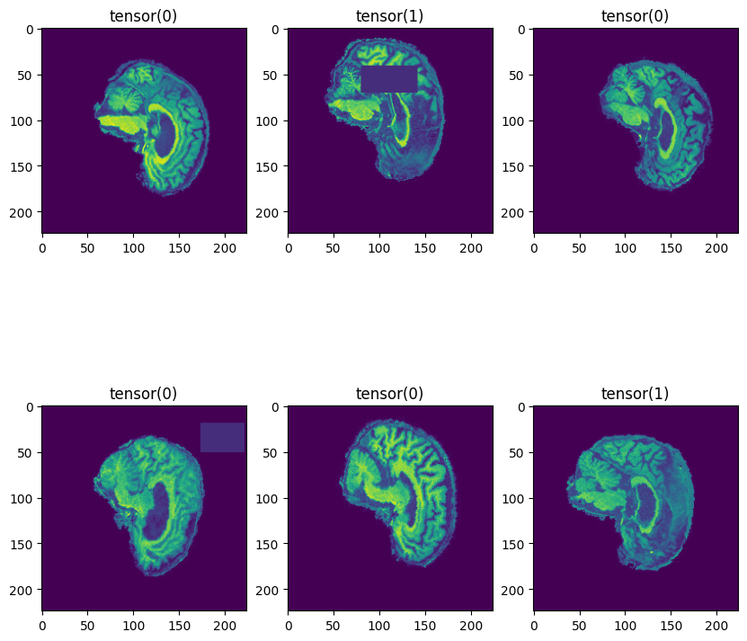
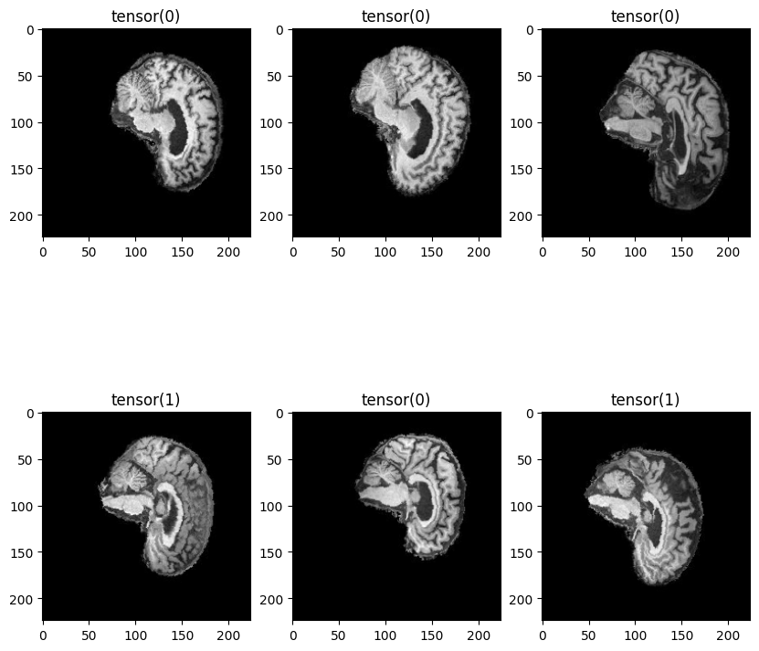
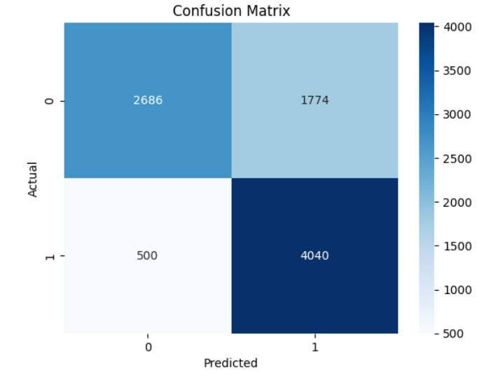
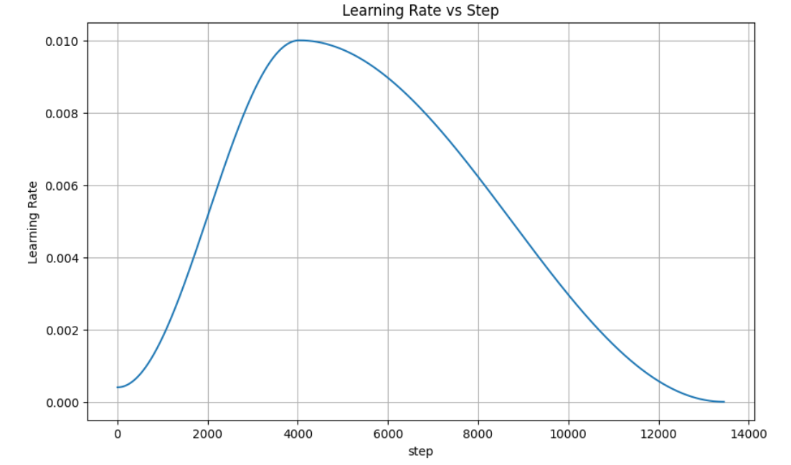
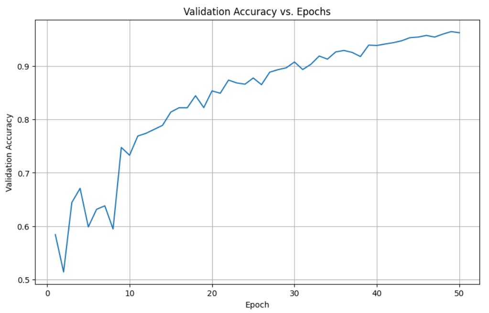
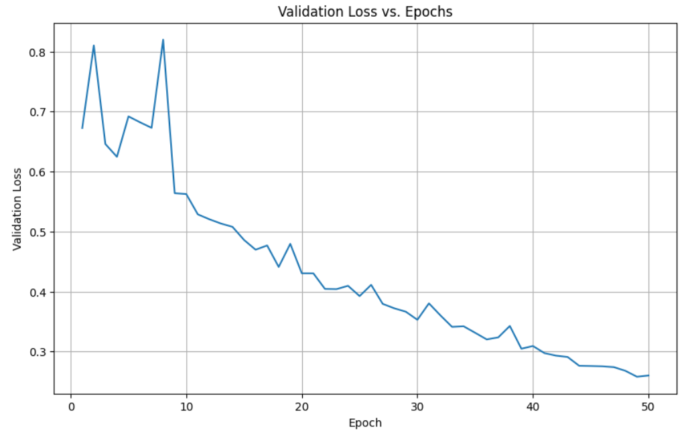

# Title 

Data loading

- additional augmentation added to preprocessing

Results of last run
Confusion Matrix

Scheduler Learning rate

Validation Accuracy vs epochs

validation loss vs epochs 

 -> Validation Loss: 0.2579, Validation Accuracy: 0.9645
Epoch [50/50], Step [100/269], TRAIN Loss: 0.2191
Epoch [50/50], Step [200/269], TRAIN Loss: 0.2421
Epoch [50/50]
  -> Validation Loss: 0.2600, Validation Accuracy: 0.9624
Training took 2111.4041414260864 secs or 35.19006902376811 mins in total

> Testing
Test Accuracy of the model on the 9000 test images: 74.73333333333333 %
Testing took 37.422730445861816 secs or 0.623712174097697 mins in total
FN = 500
FP = 1774
TN = 2686
TP = 4040

References
https://medium.com/augmented-startups/convnext-the-return-of-convolution-networks-e70cbe8dabcc

https://www.geeksforgeeks.org/computer-vision/convnext/

